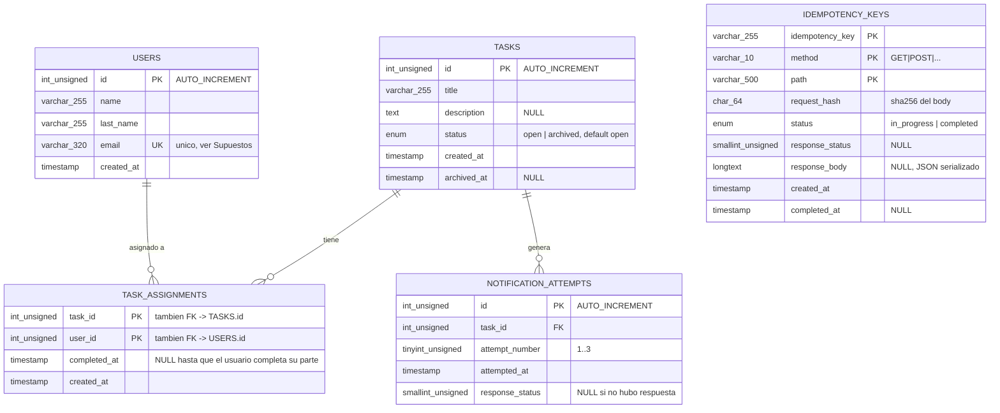

# UML de base de datos — retoGEEST

Generado a partir del esquema real en `db/migrations/`. Motor: MySQL 8, `InnoDB`, `utf8mb4`.

## Notas

- **`TASK_ASSIGNMENTS`** es la tabla de relación N:M entre `USERS` y `TASKS`. Su PK compuesta `(task_id, user_id)` es lo que impide asignaciones duplicadas (`POST /tasks/:idTask/assign`) sin necesidad de una constraint `UNIQUE` adicional.
- **`IDEMPOTENCY_KEYS`** no tiene relación FK con las demás tablas — es de propósito general, aplica a cualquier endpoint `POST` (identificada por `method` + `path`, no solo por el valor del header).
- **`NOTIFICATION_ATTEMPTS`** registra cada intento de notificación a `NOTIFY_URL` cuando una tarea se archiva (hasta 3 filas por tarea archivada).
- Además existe `schema_migrations (name VARCHAR(255) PK, applied_at TIMESTAMP)`, tabla de control interno del runner de migraciones (`db/migrate.ts`), no forma parte del modelo de negocio.
